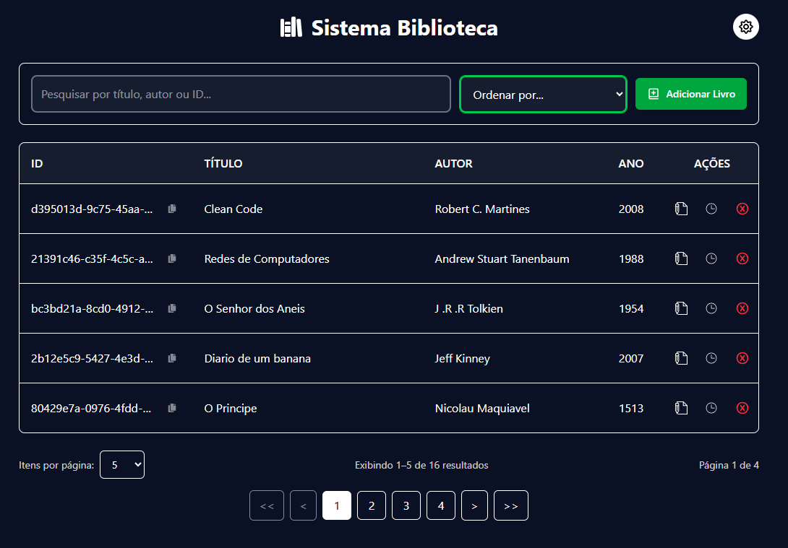

# 📚 Sistema Biblioteca


Sistema de gerenciamento de uma biblioteca completo que permite cadastrar, editar, excluir, listar e visualizar histórico de alterações dos livros. Construído com **React.js** no Front-end e **NestJS** no Back-end, utilizando **TypeORM** para persistência de dados em **SQLite3**.

---
## ℹ️ Preview


## 🚀 Funcionalidades

- Cadastro, Edição e Exclusão (com confirmação) de livros.
- Listagem de livros com busca dinâmica (título, autor, ID e ano).
- Paginação de resultados.
- **Auditoria Avançada:** Histórico detalhado de alterações por livro.
- Tema Claro/Escuro (Dark Mode).
- Feedback visual instantâneo com Toast notifications.

---

## 🛠️ Tecnologias

### Frontend
- **React.js** (com Vite)
- **React Router DOM** (Navegação)
- **Tailwind CSS** (Estilização)
- **Axios** (Integração HTTP)
- **React Hot Toast & React Icons**

### Backend
- **Node.js & NestJS** (Framework Arquitetural)
- **TypeORM** (Mapeamento Objeto-Relacional)
- **SQLite3** (Banco de dados em arquivo local)

---

## 🏗️ Arquitetura e Padrões

O projeto adota uma arquitetura client-server desacoplada:

- **Frontend (SPA):** Interface reativa que consome a API através de serviços dedicados.
- **Backend (REST API):** Desenvolvido com injeção de dependências, garantindo integridade referencial e transações ACID no banco de dados para os registros de livros, histórico e logs de auditoria.

---

## 📂 Estrutura do Projeto

Abaixo está a organização dos principais diretórios e arquivos da aplicação:

```text
Sistema-Biblioteca/
│
├── Back-end/                  # API REST em NestJS
│   ├── src/
│   │   ├── dto/               # Objetos de Transferência de Dados (Validação)
│   │   ├── entities/          # Tabelas do Banco (Book, History, Logs)
│   │   ├── interfaces/        # Contratos de tipagem
│   │   ├── app.controller.ts  # Endpoints da API
│   │   ├── app.service.ts     # Regras de Negócio e Transações
│   │   └── app.module.ts      # Injeção de Dependências e Config TypeORM
│   ├── banco-de-dados.sqlite  # Arquivo físico do banco de dados
│   └── package.json
│
└── Front-End/                 # Aplicação React + Vite
    ├── src/
    │   ├── components/        # Componentes reutilizáveis (BookForm, History, etc.)
    │   ├── pages/             # Telas da aplicação (Home)
    │   ├── services/          # Configuração do Axios (api.js)
    │   ├── styles/            # CSS Global (Tailwind)
    │   ├── main.jsx           # Ponto de entrada do React
    │   └── routes.tsx         # Configuração de roteamento
    ├── index.html
    └── package.json

```
## 🌐 Rotas Frontend (React Router)

| Rota | Descrição |
|------|----------|
| `/books` | Lista geral de livros e painel de busca |
| `/books/new` | Formulário de cadastro de novo livro |
| `/books/:id/edit` | Formulário preenchido para edição |

---

## 📡 API Endpoints (NestJS)

> **URL Base:** `http://localhost:3000`

| Método | Rota | Descrição |
|--------|------|----------|
| `GET`  | `/books` | Retorna todos os livros cadastrados |
| `GET`  | `/books/:id` | Retorna os detalhes de um livro específico |
| `POST` | `/books` | Cria um novo livro e gera registro de criação |
| `PUT`  | `/books/:id` | Atualiza o livro e mapeia os campos modificados |
| `DELETE`| `/books/:id` | Remove o livro do banco de dados |
| `GET`  | `/history/:id` | Retorna o histórico de alterações ordenado por data |

---

## ⚙️ Como Executar o Projeto

Certifique-se de ter o **Node.js** (v18+) instalado na sua máquina.

### 1. Clonar o repositório
```bash
git clone https://github.com/Yohan-B-Cys/Sistema-Biblioteca.git
cd Sistema-Biblioteca
```

### 2. Rodar o Backend
Abra um terminal e acesse a pasta do servidor:
```bash
cd Back-end
npm install
npm run start:dev
```
*O servidor estará rodando em `http://localhost:3000` e o banco SQLite será sincronizado automaticamente.*

### 3. Rodar o Frontend
Abra um **novo** terminal (mantenha o backend rodando) e acesse a pasta do client:
```bash
cd Front-End
npm install
npm run dev
```
*Acesse a aplicação no navegador através do link gerado no terminal (geralmente `http://localhost:5173`)*

---

## 👨‍💻 Autor

**Yohan Brancalhão Cys** *Estudante de Análise e Desenvolvimento de Sistemas - UFPR* 

---
## 🚀 Melhorias Futuras (To-Do)

Este projeto está em evolução contínua. Abaixo estão possíveis melhorias para o projeto:

- **Containerização:** Criar um `Dockerfile` e um `docker-compose.yml` para padronizar o ambiente de execução do banco e da aplicação.
- **Implementação de Paginação no Backend:** Adicionar suporte a parâmetros de paginação (take e skip no TypeORM) nas rotas de listagem e histórico, reduzindo o payload de rede e evitando sobrecarga de memória em alto volume de dados.
- **Implementação de Banco de Dados mais robusto:** Substituir o SQLite por um SGBD de produção (como PostgreSQL ou SQLServer), garantindo melhor controle de concorrência transacional e preparando a API para um deploy escalável em nuvem.
- **Permitir Livros Antes de Cristo:** Implementação de uma checkbox no formulário do livro para adicionar uma tag B.C (Before Christ) para livros com data correspondente, ex: A República de Platão.

## 📚 Referências e Créditos

Este projeto foi a minha primeira experiência com desenvolvimento em React, Nest e muitas outras tecnologias como parte de um processo de adaptação à stack de desenvolvimento da equipe de T.I. da Britânia. Os requisitos evoluíram de uma arquitetura simples em memória para uma API robusta com persistência de dados em banco relacional SQLite3, tabelas de log e histórico das transações, e um front-end em React-Vite e Tailwind CSS.

Materiais e documentações utilizadas como base para a construção do sistema:

* **NestJS Docs:** [Documentação Oficial](https://docs.nestjs.com/) para arquitetura, injeção de dependências e roteamento.
* **TypeORM:** [Guia de Relacionamentos e Transações](https://typeorm.io/) para a modelagem do histórico e logs de auditoria.
* **React & Vite:** [React.dev](https://react.dev/) e [Vite Docs](https://vitejs.dev/) para a construção da interface reativa.
* **Tailwind CSS:** [Documentação](https://tailwindcss.com/) para estilização e construção do Dark Mode.

Artigos e vídeos que me ajudaram:

* **Artigo do** [Medium](https://medium.com/@enockomondi305/getting-started-with-nestjs-your-first-rest-api-477e25b115cc) foi uma primeira inspiração no meu sistema por ser similar em proposta.
* **Repositório de** [Bane Sullivan](https://github.com/banesullivan/README) foi uma inspiração para este README.
* **Vídeo do canal:** [Michael Guay](https://youtu.be/9MGKKJTwicM?si=TAKW12x9THpL_9LC) utilizei junto à documentação do TypeORM para criação, relacionamento e transação entre entidades.
* **Vídeo do canal:** [Desenvolvimento do Básico](https://youtu.be/2z9iYfiujWw?si=I2bK-EH2a9NsXlRg) foi uma inspiração para a ordenação e busca na tabela.
* **Vídeo do canal:** [Dev Odair Michael](https://youtu.be/aIuZ2rxs2vw?si=JdJRl008Rj9LEkQT) me guiou para a implementação do React Icons no front-end.
* **Vídeo do canal:** [Tutorend](https://youtu.be/PCC2mESZMmQ?si=gJfNLAxKRSiskKiY) me guiou para a implementação do React Hot Toast no front-end.
* **Vídeo do canal:** [Tenacity](https://youtu.be/NGwipjJimjk?si=D5keo0VbXqHePu1F) me guiou para a implementação da funcionalidade de Dark Mode no front-end.
* **Vídeo do canal:** [Cubos Academy](https://youtu.be/KDlqPNmrUfE?si=-j36-LhEsqmqvFi3) me guiou para a implementação do React Router DOM no front-end.
* **Vídeo do canal:** [LearnWebCode](https://www.youtube.com/watch?v=OA5JAmTcTz4&t=1070s) me ajudou a introduzir aos conceitos do React.

